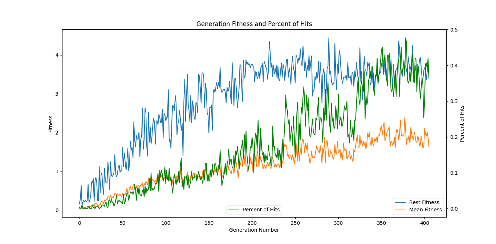

# PlanetGravity
Learning Neural Network to control rocket flight in Unity 2D with Genetic Algorithms.

## How to launch a project
1. Open project in Unity. 
2. In `Scenes` folder there are two scenes named `HumanPlayerScene` and `AIPlayerScene`. Open one of these scenes.
3. Configure properties of scene objects to your preferences, but you are good to go with defaults.
4. Start execution.

## Scenes
### Human Player Scene
The main purpose of this project is training of Neural Network, so this scene is just for simulation testing (or fun).


If you start project with "HumanPlayerScene" you can control flight of rocket by yourself: 
- control direction with arrowkeys;
- change value of velocity that you add to rocket on clicking arrowkeys with "Q" (substract) and "E" (add) keys;
- velocity options also can be configured from `RocketTarget` script properties of "Rocket" object;
- you can also experemint with checkboxes of `RocketTarget` script, though most of them are related to training Neural Network and won't affect the behavior on the scene, but you can see some debug messages indicating about some events;
- you can make run simulation faster changing `TimeScale` value in `SimulationHandler` object.

### AI Player Scene
In this scene AI player will learn to control rocket flight by itself. You can see how fitness values are changing in the left side of interface with new generations.

Most configuration can be set in `Academy` object properties:
- Num Genomes: population size.
- Num Simulate: number of genomes to simulate at once.
- Num Experiment: number of simulations to perform for one genome. Moon position doesn't reset until all experiments for genome are performed.
- Reset Position: reset position of Moon when all experiments for genome are performed.
- Crossover Rate: probability of swaping each genes of parent chromosomes.
- Mutation Rate: probability of changing value of each gene in chromosome.
- Mutation Change: percent of gene max value, that indicates max mutation change.

More complicated things need to be configured directly in scripts:
- Change structure of NN in `GeneticController.cs`. First value in array is number of input neurons, the last value is number of output neurons. All other values specify number of neurons in hidden layers.
```
new NeuralNetwork(new int[] { 8, 7, 3 })
```
- If you want to change values on input of NN, explore `AIRocketController.cs`.

Note, if you change these properties on runtime it's unlikely to take any affect. But if it's needed you can try to do this with Visual Studio Unity Debugger.

To specify when rocket is considered dead, change properties in `Rocket.prefab`. Usually "Handle Old", "Handle Collide" and "Handle Away" are used.

## UI
Here is some explanation for UI:
- Main camera in the center shows current positions of objects and their trajectories. Sizes of objects on this camera don't represent their real sizes.
- Camera on the right side is attached to specific object, on both scenes it's rocket. This camera shows real sizes of objects.
- Rocket changes angle to its velocity direction. The rocket's flame is directed in opposite direction of added velocity. The length of flame indicates magnitude of added velocity.
- For `AIPlayerScene` on the right side there is a slider for configuring `TimeScale` value.

All other UI elements, that are placed on the left side, are related to Neural Network training: 
- Experiment: current simulated experiment number. If in `Academy` the `Num Experiment` is 1, then this field always will be 1.
- Genome: current simulated genomes range.
- Generation: current generation number. Starts from 0, as initial population.
- Current Experiment Fit: fitness value in current moment for best alive rocket, that is currently simulated.
- Best Experiment Fit: best experiment fitness value for all simulated experiments.
- Best Genome Fit: best genome fitness value for all simulated genomes. Will be the same as "Best Experiment Fit" if `Num Experiment` is 1.
- Last Generation Avg fit: avarage fitness value for genomes of last simulated generation.
- Best Generation Avg fit: best avarage generation fitness value for all simulated generations.
- Current Genome Hits Number: number of times, when rocket of current simulated genome hit the Moon.
- Best Genome Hits: best percent of genome hits. Value "0%" means there were no hits yet; if "100%" there was genome for which all rockets hit the destination.
- Last Generation Hits: percent of hits for last simulated generation.
- Best Generation Hits: best percent of generation hits for all simulated generations.
- Diagram shows structure of NN with green edges for positive values, red edges for negative values. Thicker line indicates higher values.


Some values are written to files in `Saves` folder:
- values of fitness are written in `fits.csv` file in this format: 
```
fit_generation_1_genome_1, fit_generation_1_genome_2, ..., fit_generation_1_genome_N,
fit_generation_2_genome_1, fit_generation_2_genome_2, ..., fit_generation_2_genome_N,
...
```
- values of hits percent are written in `hits.csv` file in this format: 
```
hit_generation_1
hit_generation_2
...
```
- weights along with its NN structure of best network in each generation are written in `NetworkSaves` folder. Yet there is no interface for reading this NN saves though. 

Note that saves are rewritten with each new execution of `AIPlayerScene`.

To build graphs for fits and hits files you can use python code in this repository: [RocketGeneticsGraphBuilder](https://github.com/VitalikPretsel/RocketGeneticsGraphBuilder).

## Planet Simulation
I've used Newton's law of universal gravitation to simulate movement of objects in the system, though I turned off gravity force for Earth to keep it immovable, but you can play with checkboxes to see what happens. For `G` I used value of 1.

To make Moon move around the Earth I assigned initial velocity to it using `AddForce()` method with `Impluse` mode. It should represent the real world velocity in our scale, so simulation would look realistic. I came up with this formula for calculating force for initial impulse:
```
F = 
    ([Mass of Moon] * [Speed of Moon]) * 10^5
    / ([Time to redraw frame] * ([Distance between centers of Moon and Earth] + [Moon radius] + [Earth radius])) 
```
It reminds the Newton's second law, but I don't really understand why I needed to include `10^5` and `distance`. But it just works. You may try to set initial velocity using `velocity` property of rigidbody, not `AddForce()` method as I did.


I tried to use real world scales for this project: distance between Earth and Moon, their sizes and masses are similar to real. But rocket is much heavier and bigger than real, I couldn't make such small details work in Unity.

For configuring behavior of gravitation and setting up own planet system change mass values of rigidbodies and edit properties of `GravityTarget.cs`.

## Fitness
Fitness is calculated as `f(x) = 1/x`, where `x` - distance between player (rocket) and destination (Moon). 
- Only highest value of experiment fitness is used, so for selection we consider value when rocket was closest to the Moon.
- If rocket has died not with "away" or "hit" conditions, fitness is signed to 0.
- For more than 1 experiment per genome, we calculate fitness for genome as avarage of all experiments.

## Examples of Neural Network training
### Training with same starting Moon position
For this training Moon resets its position with each new simulated genome and only one experiment per indiviudal is performed.
This training is pretty simple and rocket learns to hit the Moon with every genome until 20 generation is reached. For this training using NN with structure `{ 8, 7, 3 }` and population size 30 is enough. (I actually think that we can use only 6 neurons for input, ignoring velocity of Moon values, position of Moon should be enough.)


Watch this video for training demonstration (in this video was used NN with simpler structure: `{ 6, 5, 3}`): [Learning Neural Network to control rocket flight with Genetic Algorithms | [6-5-3]](https://youtu.be/zu4rwIHNGGI)

### Training with different starting Moon position
In this training for each individual 50 simulations were performed (`Num Experiment` equal 50). This task is much harder and I couldn't achieve perfect results. 
I was using NN with more complicated structure: `{ 8, 13, 13, 3 }`, and population size was 100. I was trying to play with  `MutationChange` property during learning, changing its values from Visual Studio Unity Debugger: 
- generations 1-115: `MutationChange = 0.01`;
- generations 116-170: `MutationChange = 0.001`;
- generations 171-430: `MutationChange = 0.0001`.
As a result, the best individual was hitting the Moon in 15/50 simulations, this result was reached after 120 generations approximately. After that only avarage number was improving.



Note: with this configuration training takes a long of time. With my machine I waited three days to get 400 generations.

Watch this video for demonstration of training results: [Learning NN to control rocket flight with GA | [8-13-13-3] [generation 421-422]](https://youtu.be/IUnOnRVp8vM)

## Notes
- Collisions may work wrong in simulation. I tried to use `FixedJoint`, but I guess it's wrong approach and I need to use friction force instead. 
- Need to find a way to automate process of changing a `MutationChange` and other genetics properties during runtime.
- Need to implement reading NNs from file.
- For `hits.csv` save hits percent for each genome of population, not avarage.
- Neural Network is training good if you reset Moon position on each rocket launch (experiment = 1 in `Academy`). But I couldn't train Neural Network good enough for different Moon positions (experiment > 1). 

## Acknowledgements
- Please see this repo with [Self_Driving_Car](https://github.com/JohnDavidAnthony/Self_Driving_Car), since I used a lot of it as a basis for my project.
- This repo helped me to implement gravity simulation: [GravityBasics](https://github.com/ZeroKelvinTutorials/GravityBasics).